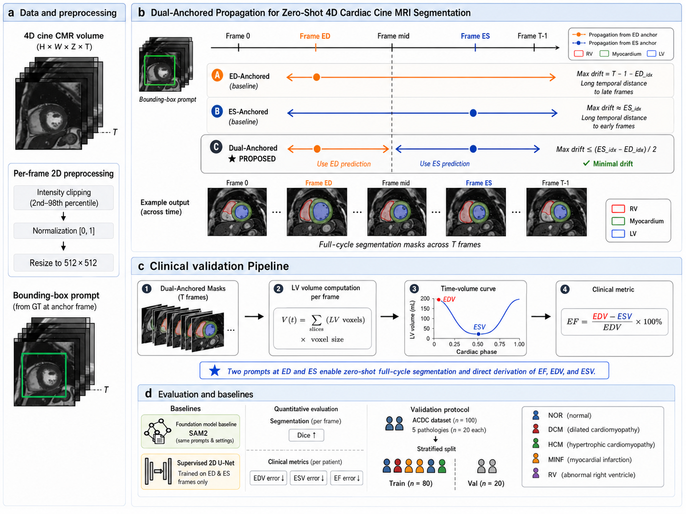
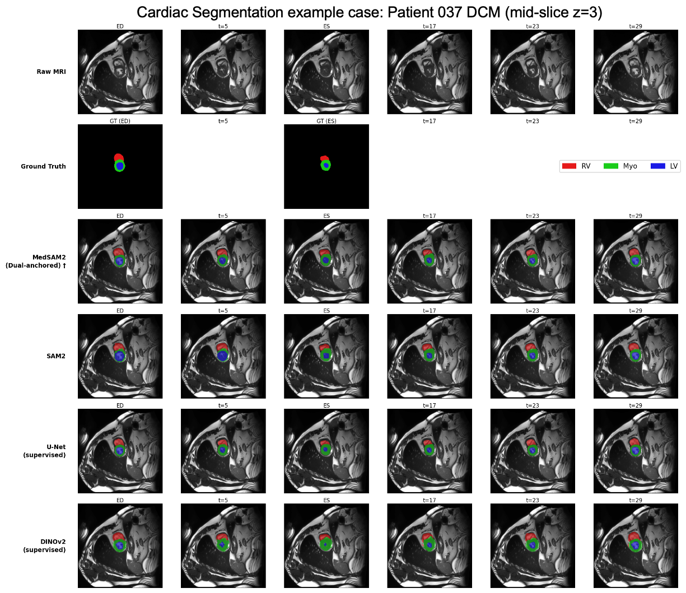
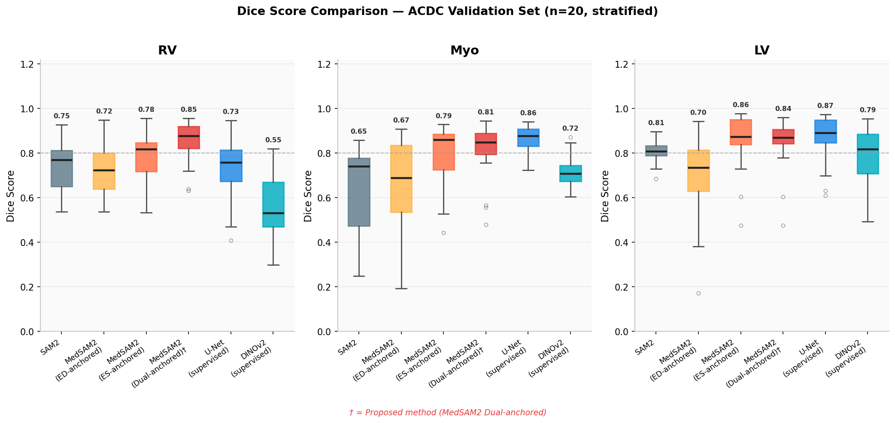
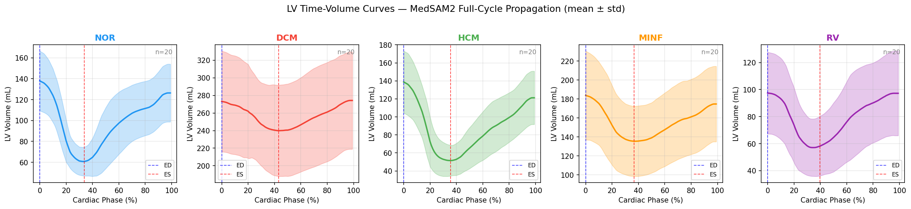
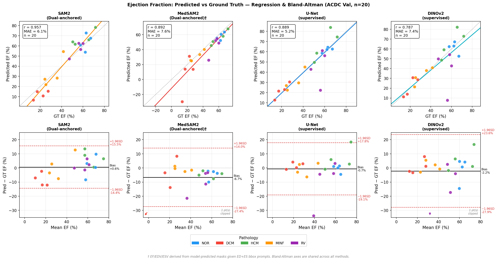

# Zero-Shot 4D Cardiac Cine MRI Segmentation via Dual-Anchored Video Propagation

**Venue:** Medical Image Understanding and Analysis (MIUA) 2026 — Special Session  
**Status:** Submitted

---

## Abstract

Automatic segmentation of cardiac structures across the full cardiac cycle is essential for computing ejection fraction (EF) and time-resolved volume curves — the gold standard metrics for diagnosing cardiomyopathies and heart failure. Existing supervised methods (U-Net, DINOv2) are trained on only two annotated frames per cycle (end-diastole, end-systole), leaving the remaining ~25 frames unanalyzed and requiring expensive re-annotation when scanner protocols or patient populations change.

We propose a **dual-anchored bidirectional propagation** strategy using **MedSAM2**, a video foundation model fine-tuned on medical images. Given ground-truth segmentation prompts at two frames — the end-diastolic (ED) and end-systolic (ES) frames — MedSAM2 propagates segmentation masks across all ~30 frames of the cine MRI cycle without any task-specific training.

On the ACDC benchmark (n=20, stratified validation set), our proposed method achieves:
- **Dice: 0.850 / 0.809 / 0.843** (RV / Myocardium / LV) — surpassing supervised U-Net on RV (0.730) with zero training
- **EF MAE: 7.63%, Pearson r=0.892** — approaching supervised U-Net (MAE 5.18%, r=0.889)

Zero-shot generalization is further validated on the multi-vendor M&Ms dataset (136 patients, 4 scanner manufacturers) with no re-training.

---

## Method: Dual-Anchored Propagation



MedSAM2 uses a causal memory bank: when prompted at a single frame, it propagates forward/backward through the sequence. However, temporal drift accumulates with distance from the prompt anchor.

**Key insight:** Using *two* anchors (ED + ES) ensures that every frame is at most `(es_idx - ed_idx) / 2` steps from the nearest anchor — minimizing maximum drift.

**Algorithm:**
```
Input:  Cine sequence F = {f_0, ..., f_{T-1}}
        GT bounding box at ed_idx (ED frame)
        GT bounding box at es_idx (ES frame)

Step 1 — ED-anchored pass:
        Prompt MedSAM2 at ed_idx → propagate fwd/bwd → ed_pred[t] for all t

Step 2 — ES-anchored pass:
        Prompt MedSAM2 at es_idx → propagate fwd/bwd → es_pred[t] for all t

Step 3 — Merge:
        mid = (ed_idx + es_idx) // 2
        S[t] = ed_pred[t]  if t <= mid
               es_pred[t]  if t >  mid

Output: Full-cycle segmentation S = {s_0, ..., s_{T-1}}
```

**Ablations (same model, different anchoring):**
- `MedSAM2 (ED-anchored)` — prompt at ED only, propagate fwd+bwd
- `MedSAM2 (ES-anchored)` — prompt at ES only, propagate fwd+bwd

---

## Results

### Table 1: Segmentation Accuracy — ACDC Validation Set (n=20)

| Method | RV Dice | Myo Dice | LV Dice |
|--------|---------|----------|---------|
| SAM2 (vanilla) | 0.745 ± 0.111 | 0.647 ± 0.192 | 0.806 ± 0.045 |
| MedSAM2 (ED-anchored) | 0.716 ± 0.111 | 0.667 ± 0.200 | 0.699 ± 0.193 |
| MedSAM2 (ES-anchored) | 0.784 ± 0.116 | 0.789 ± 0.137 | 0.856 ± 0.125 |
| **MedSAM2 (Dual-anchored) †** | **0.850 ± 0.092** | **0.809 ± 0.125** | **0.843 ± 0.111** |
| U-Net (supervised) | 0.730 ± 0.137 | 0.861 ± 0.059 | 0.868 ± 0.105 |
| DINOv2 (supervised) | 0.553 ± 0.142 | 0.719 ± 0.072 | 0.793 ± 0.122 |

† Proposed method. Zero-shot: no cardiac-specific training.

### Table 2: Clinical Metrics — EF / EDV / ESV (ACDC Validation, n=20)

| Method | EF MAE | EF r | EDV MAE | EDV r | ESV MAE | ESV r |
|--------|--------|------|---------|-------|---------|-------|
| SAM2 | 6.07 ± 4.34% | 0.957 | 64.2 ± 26.3 mL | 0.978 | 38.5 ± 38.2 mL | 0.987 |
| MedSAM2 (ED-anchored) | 9.92 ± 8.32% | 0.868 | 23.2 ± 39.7 mL | 0.769 | 21.9 ± 30.8 mL | 0.857 |
| MedSAM2 (ES-anchored) | 7.61 ± 4.51% | 0.968 | 15.1 ± 27.9 mL | 0.903 | 16.2 ± 20.0 mL | 0.938 |
| **MedSAM2 (Dual-anchored) †** | **7.63 ± 9.62%** | **0.892** | 23.2 ± 39.7 mL | 0.769 | 16.2 ± 20.0 mL | 0.938 |
| U-Net (supervised) | **5.18 ± 7.59%** | 0.889 | **5.4 ± 6.6 mL** | **0.993** | **8.7 ± 10.5 mL** | **0.982** |
| DINOv2 (supervised) | 7.42 ± 10.65% | 0.787 | 12.7 ± 10.9 mL | 0.976 | 12.2 ± 14.6 mL | 0.966 |

### Figures

| Figure | Description |
|--------|-------------|
|  | Full-cycle segmentation comparison across methods |
|  | Dice score distributions by structure and method |
|  | LV time-volume curves by cardiac pathology group |
|  | EF regression (r=0.892) and Bland-Altman analysis |

---

## Setup

### Environment

```bash
module load conda        # HPC: load conda
conda activate cinema_ft
```

Key packages: `torch`, `numpy`, `nibabel`, `SimpleITK`, `scipy`, `matplotlib`, `seaborn`, `scikit-learn`, `pandas`

### Third-Party Dependencies (install separately)

These repos must be cloned alongside this project and are **not** included (too large):

```bash
# MedSAM2 — required for inference
git clone https://github.com/MedSAM2/MedSAM2.git MedSAM2
# Download checkpoint: MedSAM2_latest.pt → MedSAM2/checkpoints/

# SAM2 — required for vanilla SAM2 inference
git clone https://github.com/facebookresearch/sam2.git sam2

# DINOv2 — required for DINOv2 training/inference
git clone https://github.com/facebookresearch/dinov2.git dinov2
```

### Dataset Download

Datasets are **not included** in this repo. Download from official sources:

- **ACDC:** [MICCAI ACDC Challenge](https://www.creatis.insa-lyon.fr/Challenge/acdc/databases.html)  
  → Place in `database/training/` (100 patients, each with `patient{NNN}/Info.cfg` and `.nii.gz` files)

- **M&Ms:** [Multi-Centre, Multi-Vendor Challenge](https://www.ub.edu/mnms/)  
  → Place in `MnM/` and `MnM2/`

---

## Reproducibility

### 1. Preprocess Data

```bash
# ACDC full dataset (4D .nii.gz → per-patient .npz slices)
python prep_acdc_4d.py

# ACDC test set
python prep_acdc_test.py

# M&Ms dataset
python prep_mnm.py

# MnM2 short-axis
python prep_mnm2_sa.py
```

Preprocessed data is saved to `preprocessed/` (ACDC) and `preprocessed_mnm/` (M&Ms).

### 2. MedSAM2 Inference — Zero-Shot (no training required)

Runs all three modes (ED-anchored, ES-anchored, Dual-anchored) in a single pass:

```bash
# ACDC validation set
cd MedSAM2
python ../infer_medsam2.py \
    --ckpt checkpoints/MedSAM2_latest.pt \
    --cfg  configs/sam2.1_hiera_t512.yaml \
    --data /path/to/preprocessed \
    --out  /path/to/results/medsam2

# or via SLURM:
sbatch jobs/job_medsam2.sh

# M&Ms cross-vendor generalization:
sbatch jobs/job_medsam2_mnm.sh
```

### 3. U-Net Training — Supervised Baseline

```bash
# Train on 80 ACDC patients (ED+ES slices), evaluate on 20-patient val set
python train_eval_unet.py \
    --db     database/training \
    --out    results/unet \
    --epochs 30 \
    --batch  16 \
    --lr     1e-4

# or via SLURM:
sbatch jobs/job_unet.sh

# Evaluate only (if model already trained):
python train_eval_unet.py --eval_only

# Cross-vendor inference on M&Ms:
python infer_unet_mnm.py
sbatch jobs/job_unet_eval_mnm.sh
```

### 4. DINOv2 Training — Supervised Baseline

```bash
# Train DINOv2-S/14 decoder on ACDC ED+ES slices
python train_eval_dinov2.py \
    --epochs 50 \
    --batch  8 \
    --lr     1e-4

# or via SLURM:
sbatch jobs/job_dinov2.sh

# Evaluate only:
python train_eval_dinov2.py --eval_only

# Cross-vendor inference:
python infer_dinov2_mnm.py
sbatch jobs/job_dinov2_eval_mnm.sh
```

### 5. Evaluation & Figure Generation

```bash
# Compute all metrics (Dice, HD95, EF/EDV/ESV) for all methods
python compute_all_metrics.py --dataset acdc_val

# Generate all paper figures (requires results to exist)
python evaluate_and_figures.py \
    --results_dir results \
    --db          database/training \
    --fig_dir     figures

# or via SLURM:
sbatch jobs/job_figures.sh
```

---

## Project Structure

```
MIUA-2026/
├── README.md
│
├── figures/                      # Paper-ready figures (final versions)
│   ├── fig1_methods.png          # Method diagram: Dual-Anchored Propagation
│   ├── fig2_qualitative.png      # Full-cycle segmentation comparison
│   ├── fig3_boxplot.png          # Dice score distributions
│   ├── fig4_timevolume.png       # LV time-volume curves by pathology
│   └── fig5_ef_ba_right.png      # EF regression + Bland-Altman
│
├── results/
│   ├── table1_dice.csv           # Dice scores (ACDC val n=20)
│   ├── table_clinical_acdc.csv   # EF/EDV/ESV metrics (ACDC val n=20)
│   └── unet/results.json         # U-Net detailed results
│
├── # -- Preprocessing --
├── prep_acdc_4d.py               # ACDC 4D NIfTI → per-slice .npz
├── prep_acdc_test.py             # ACDC test set preprocessing
├── prep_mnm.py                   # M&Ms dataset preprocessing
├── prep_mnm2_sa.py               # MnM2 short-axis preprocessing
│
├── # -- Inference --
├── infer_medsam2.py              # MedSAM2: ED/ES/Dual-anchored inference
├── infer_sam2.py                 # Vanilla SAM2 inference
├── infer_unet_mnm.py             # U-Net inference on M&Ms
├── infer_dinov2_mnm.py           # DINOv2 inference on M&Ms
│
├── # -- Training (supervised baselines) --
├── train_eval_unet.py            # U-Net: train + evaluate on ACDC
├── train_unet_combined.py        # U-Net: train on ACDC+MnM combined
├── train_eval_dinov2.py          # DINOv2: train + evaluate on ACDC
├── train_dinov2_combined.py      # DINOv2: train on ACDC+MnM combined
│
├── # -- Evaluation & Figures --
├── compute_all_metrics.py        # Compute Dice, HD95, EF/EDV/ESV for all methods
├── evaluate_and_figures.py       # Generate all paper figures
│
└── jobs/                         # SLURM job submission scripts
    ├── job_medsam2.sh            # MedSAM2 inference (ACDC)
    ├── job_medsam2_mnm.sh        # MedSAM2 inference (M&Ms)
    ├── job_unet.sh               # U-Net training
    ├── job_unet_eval_mnm.sh      # U-Net evaluation on M&Ms
    ├── job_dinov2.sh             # DINOv2 training
    ├── job_dinov2_eval_mnm.sh    # DINOv2 evaluation on M&Ms
    ├── job_prep*.sh              # Data preprocessing jobs
    ├── job_metrics.sh            # Metric computation
    └── job_figures.sh            # Figure generation
```

---

## Datasets Summary

| Dataset | Split | Patients | Scanner Vendors | Pathologies |
|---------|-------|----------|-----------------|-------------|
| ACDC | Train | 80 | Siemens | NOR, DCM, HCM, MINF, RV (16 each) |
| ACDC | Val | 20 | Siemens | NOR, DCM, HCM, MINF, RV (4 each) |
| M&Ms | Test | 136 | Siemens, Philips, GE, Canon | Mixed |

---

## Citation

If you use this code or results, please cite:

```bibtex
@inproceedings{li2026medsam2cardiac,
  title     = {Zero-Shot 4D Cardiac Cine MRI Segmentation via Dual-Anchored Video Propagation with Clinical Validation},
  author    = {Li, Zhuoan},
  booktitle = {Medical Image Understanding and Analysis (MIUA)},
  year      = {2026},
  publisher = {Springer}
}
```
